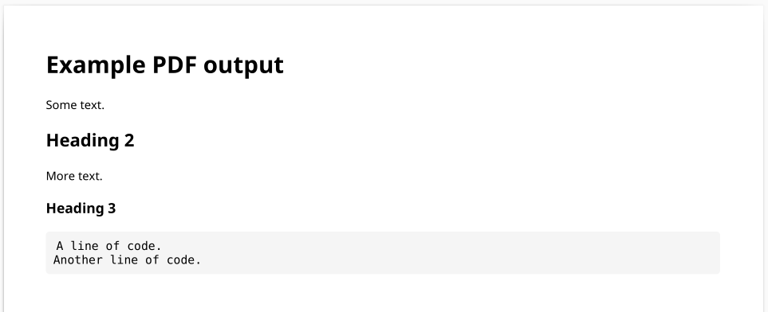
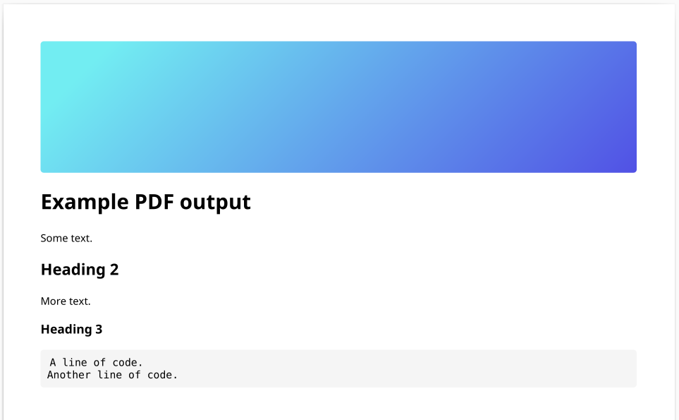
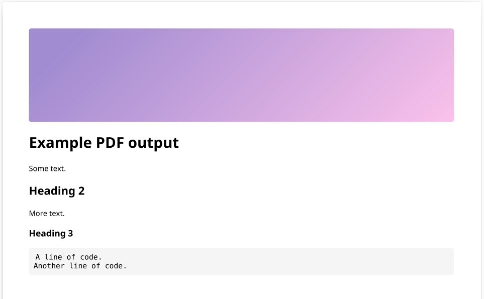
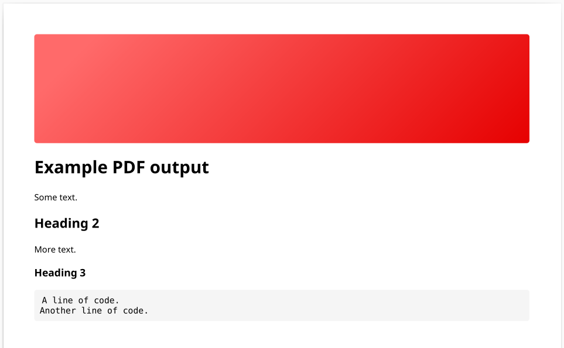

# repo2md

Simple utility to generate a PDF file from a markdown document.

### Features

- Custom code block style with set background and fonts
- Basic custom header styles

> [!NOTE]
> This utility aims to retain as much markdown formatting as possible, and convert it into a PDF file type. Optional header styles are also available.

## Usage

### Quick start

```
. setup.sh
python3 md2pdf.py --md_file_path ~/Downloads/example.md --pdf_file_path ~/Downloads/output.pdf --style blank
```

### Detailed

1. Install apt packages in `apt-packages.txt`
2. Create and activate a Python `venv` (optional but recommended)
3. Install Python packages in `requirements.txt`
4. Run `python3 md2pdf.py --help` for a full list of arguments


## Examples

### Blank header



### Blue header



### Purple header



### Red header

